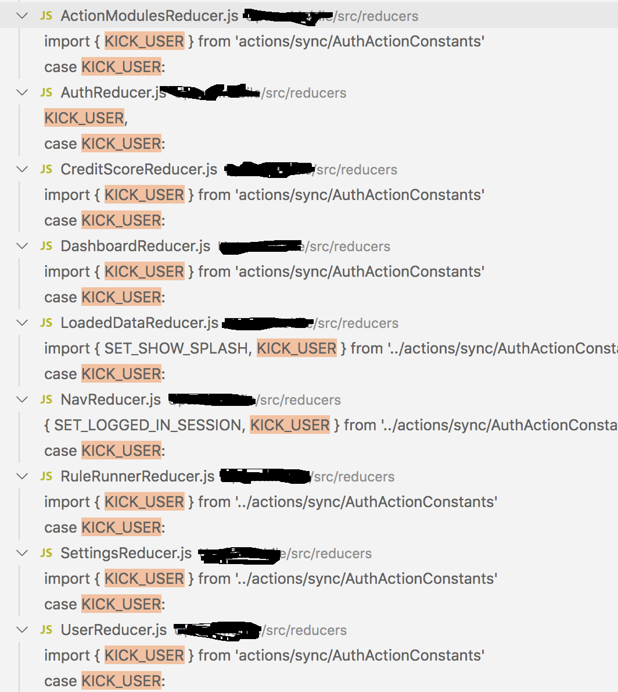

# Actions and Reducers separation

The separtion of Action logic and Reducer state changes in Redux have some consequences

One action could have effects on several reducers, creating complexity and diminishing readability, this is also caused by the separation of state into stores (reducers)

The holly grail of readability of effects in Flux IMO is to have everything that happens on an event (action) in a single file, in the case of redux the action logic and the state changes are separate processes so this is imposible and to make it worse a single dispatch could affect n amount of reducers.

Here is an example of a real production application in Redux

We dispatch an action when something happens

```js
...
dispatch(kickUser())
...
```

the action is just a simple action creator

```js
export function kickUser() {
  return {
    type: KICK_USER,
  }
}
```

And in order to know what happens in the code we need to make a search for the constant `KICK_USER`



So there it goes the goal of looking at one file and knowing what it going to happen to the state of the app!

One of the biggest dangers of this is that any developer could come and break the state by changing one reducer without having the complete picture.

Lets compare it with a React.js + Baobab.js

actions.js

```js
// Baobab.js actions
var stateTree = require('./stateTree');
var ajax = require('ajax');
module.exports = {
  showOnlyProductsInStock: function () {
    stateTree.set('onlyProductsInStock', true);
  },
  showAllProducts: function () {
    stateTree.set('onlyProductsInStock', false);
  },
  searchProducts: function (query) {
    stateTree.set('query', query);
    ajax.get('/products', query)
      .done(function (products) {
        stateTree.set('products', products);
      });
  }
};
```

in searchProducts we edit the state, get the products from the server, and then set the productions in the the state, all in one action! in Redux we would probly be able to make something similar but it would be impossible to just open the action and know exactly what is going to happen and where.

```js
// Redux Thunk
export function searchProducts(query) {
  return dispatch => {
    dispatch({
      type: SET_QUERY,
      query,
    })
    dispatch(getProducts(query))
    .then((products) => {
      dispatch({
        type: SET_PRODUCTS,
        products,
      })
    })
  }
}
```

There are two very important questions here:

1) What is happening to the state
2) How many reducers use this?

When your app starts to grow like the example above things start to get complicated.
