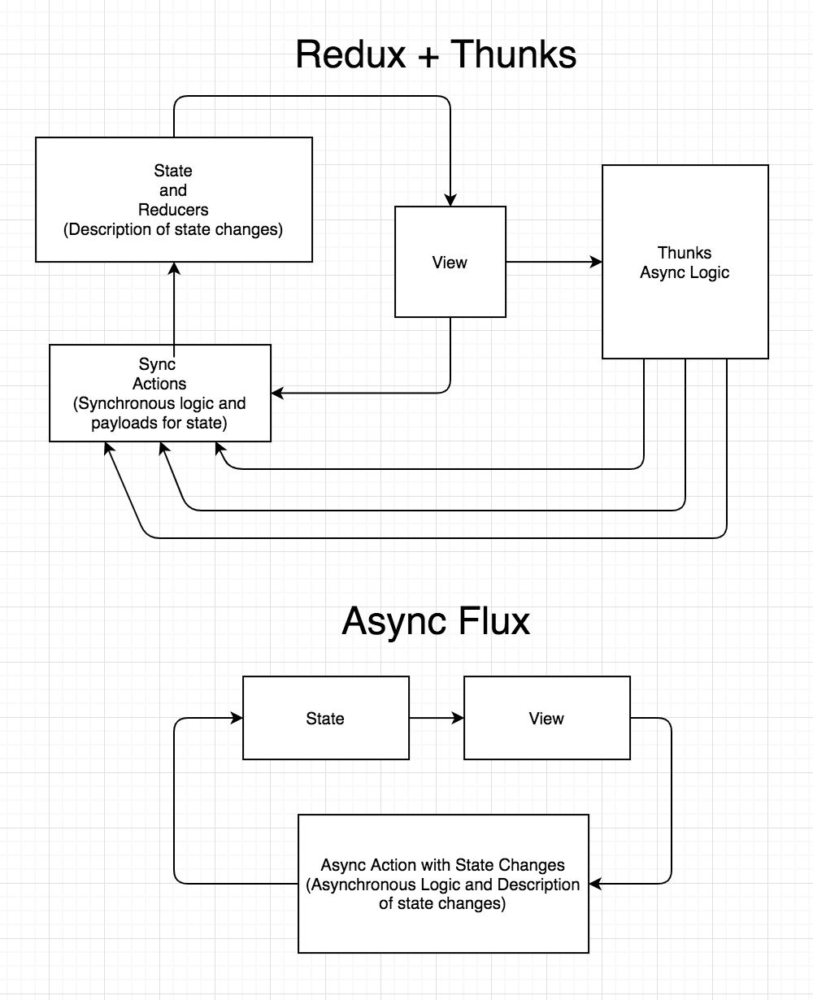

# Thunks in redux

"Redux makes synchronous state updates explicit and reasonable, and makes visible the contract between React and the application: UI is a function of state, and it’s for this reason I’ll continue to use it." - [Christian Chown](https://medium.com/@christianchown/dont-use-async-redux-middleware-c8a1015299ec)

One of the most popular sollutions for asynchronous logic in Redux are Thunks, it allows you to send functions through the Redux `dispatch()` method than can execute asynchronous logic and `dispatch` more actions.

```js
function makeASandwichWithSecretSauce(forPerson) {
  return function(dispatch) {
    return fetchSecretSauce().then(
      (sauce) => dispatch(makeASandwich(forPerson, sauce)),
      (error) => dispatch(apologize('The Sandwich Shop', forPerson, error)),
    );
  };
}
```

There are two main problems with this sollution:

## We don't know what is happening in state

By looking at a thunk its impossible to know its effects on state, this separation between actions and reducers hinders the mental visualization of the system.

## We don't know how many reducers are affected by our actions

This is probably the worst feature of Redux IMHO, one dispatch could be used by 35 reducers making near impossible a mental visualization of the effects of actions in complex systems.

## Thunks are not actions

Altho Thunks are a Rudux middleware hence technically a part of the Redux system, it is not really integrated into Redux, its better to see it as an external component that has access to the store and can get state and dispatch actions.

We could take out Thunks from the middleware and make it a separated library and it would be exactly the same, we would just have two dispatch functions, syncDispatch and ThunkDispatch.

I would like to see an Async Flux Redux...


